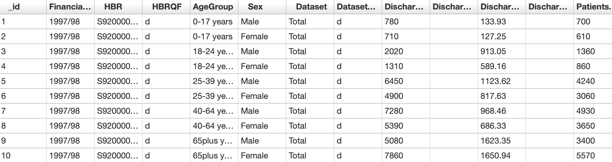

```{r load-packages, include = FALSE}
# Add any additional packages you need to this chunk
library(tidyverse)
library(palmerpenguins)
library(knitr)
library(xaringanthemer)
library(readr)
```

```{r setup, include=FALSE}
# For better figure resolution
knitr::opts_chunk$set(fig.retina = 3, dpi = 300, fig.width = 6, fig.asp = 0.618, out.width = "80%")
```

```{r load-data, include=FALSE}
 age_and_sex <- read_csv("age and sex.csv")
 glimpse(age_and_sex)

```

```{r include=FALSE}
style_xaringan(
  title_slide_background_image = "img/pink_ background_files/"
)

```

class: center, middle

**_Research Question_**  

How a patients' age and sex affects the likelihood of discharge from NHS hospital care.

---

class: inverse, center, middle

```{r, echo = FALSE,out.width = "40%", fig.align = "centre",}


```


**_Introduction_** 

- The dataset we have chosen comes from the Public Health Scotland website, where NHS organisations can use the platform to publish and share their own datasets that meet the requirements set out in the Scottish Government Open Data Strategy.

- Before data is released it is first assessed for statistical disclosure to ensure the data is reliable and as accurate as possible.


---

**_Cases and Variables_** 

Each individual case (id), in this data set represents an individual patient.

Some of the key the variables in this data set include:

- _FiniancialYear_: 
Financial years start on 1 April and end on 31 March. For example, financial year 2017/2018 covers the period 1 April 2017 – 31 March 2018.

- _AgeGroup_: 
Refers to the patient's age on admission. Ages have been arranged in five different groups.

- _Sex_: 
The patient's sex, as recorded on admission.

- _DischargeCount_:
The total number of discharges. A hospital discharge marks the end of an episode of care. Discharges include deaths, transfers to other specialties/significant facilities and hospitals, and discharges home or to other regular place of residence.

- _PatientCount_: 
The total number of patients. A patient is defined as an individual discharged from hospital (including as a transfer out) at least once during the financial year. Regardless of how many times they have been discharged during the financial year, patients are counted only once in each financial year at the Scotland level. However, if their age band and/or sex changes during the year, they will be counted more than once.


---

class: inverse, middle, center

**_A Snap Shot of the Data_** 

```{r, echo = FALSE}




```


---

**_Data Analysis Plan_**


The four main variables we expect to be the focus of our  analysis are:

1. Age Group 
2. Sex 
3. Discharge Count 
4. Patient count 

Comparison Groups:

- There are 5 comparable sub-groups within the "AgeGroup" variable; (0-17, 18-24, 25-39, 40-64 and 65+)

- There are 2 comparable sub-groups within the "Sex" variable; (male and female) 

--- 
---

**_Preliminary Exploratory Data Analysis_**

```{r, echo = FALSE}

ggplot(age_and_sex, aes(x = AgeGroup, y = PatientsCount)) +
geom_point() +
  labs(title = "Number of Patients in Different Age Groups", 
       x = "Age Group",
       y = "Patient Count")
```
---
```{r, echo = FALSE}
ggplot(age_and_sex, aes(x = AgeGroup, y = DischargeCount)) +
geom_point()+
  labs(title = "Discharge Count Across Different Age Groups",
       x = "Age Group",
       y = "Discharge Count")


```
---
```{r, echo = FALSE}
age_and_sex %>%  
  select(DischargeCount) %>% 
  summarise(avg_ds = mean(DischargeCount),
            max_ds = max(DischargeCount),
            min_ds = min(DischargeCount)) 

```
**_Key Summary Statistics:_**

Maximum Discharge Count = 11750

Minimum Discharge Count = 0

Average Discharge Count = 284

---
**_Summary_**

**0~17 Age group:**

- Had the lowest patient and discharge count of all the age groups.
- This is a result we hypothesized before carrying out any data analysis.

**40~64 Age Group:**

 - Had the highest patient and discharge count across both graphs.
- Possible reasons may be due to that age group making up a large demographic within the UK.
 
**65+ Age Group:**

 - Second highest count on both graphs.
 - This result was slightly unexpected, however there is still a lot of analysis to be carried out.
 
---
